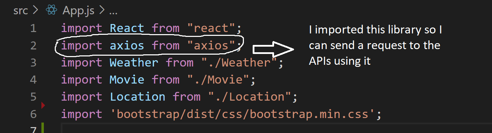

    

    
here I did a console log to see if the output is correct

  
and this is the output in the browser

  

    

this the rundered part for getLocation function and it's working

    
this is the rendered part for getWeather funtion and it's working 

    

this is the rendered part for getMovie function and it's working 
 
